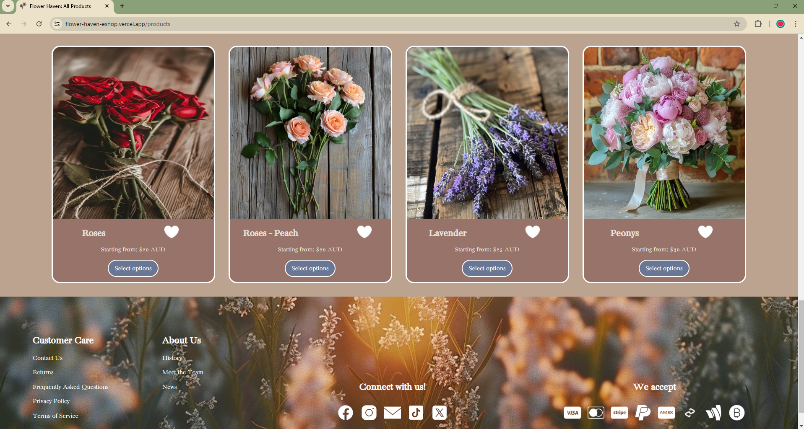

# React E-shop Project: Flower Haven &#127804;

A simple flower shop e-commerce site that allows users to browse through a range of flowers. 

Deployed Link: [Flower Haven E-Shop](https://flower-haven-eshop.vercel.app/)

## Key Features
- Landing page with a carousel of featured products
- Product page with a grid of products and their details (image, price, size, description)
- Wishlist page with a grid of products a user has wishlisted 
- Cart feature to allow users can add/delete items to their cart

## Next Step: Future features/improvements:
- Adding update feature to cart (update quantity and sizes)
- Ability to 'pay' using Stripe 

## TechStack
JavaScript | SCSS |  React | Firestore 